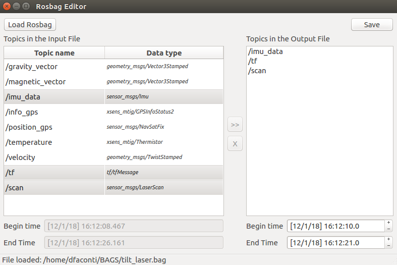

# Rosbag Editor

If:

- you need to remove one or more topics from a [rosbag](http://wiki.ros.org/rosbag).
- you want to change the duration of the rosbag (initial and final time).
- you dislike complicated [command line interfaces](http://wiki.ros.org/rosbag/Commandline#filter) as much as I do.

Then this application is the right for you.

To run it, use the command:

      rosrun rosbag_editor rosbag_editor

